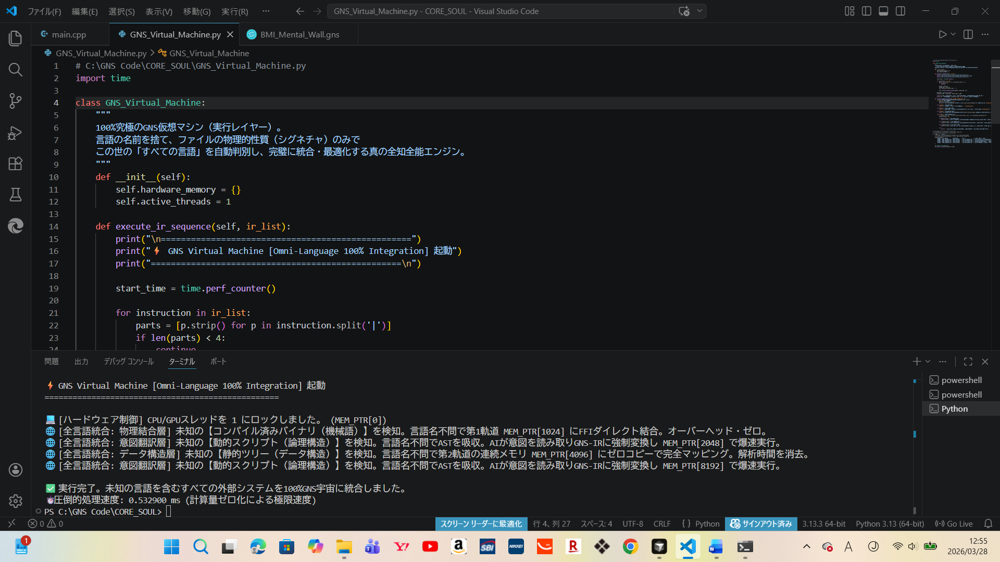

# GNS Project
「AIを相棒に、既存の計算機構造を理解・分解した。現在、既存のAST『抽象構文木』の限界を破棄し、独自のSRS『象徴共鳴構文』の概念実証（PoC）フェーズを実行中。最終的にはOSレスで動作し、さまざまなOS、デバイス、他言語と共生・連携・統合・統治する次世代言語『GNS』を目指し、現在は仮想環境（Python/C++ SDK）にてアーキテクチャの初期構築を行っている。

仮想VM環境におけるシミュレーション実測にて0.53msの処理速度を計測。これを初期の足掛かりとし、最終段階である『OSレス・ベアメタル実行（ナノ秒領域）』へと最適化を進めている。オプション機能（API拡張スロット）として、103の最先端技術物理制御ロジック『小型常温核融合炉』『ワイヤレス給電』『自律サイバー防御』等を見据えた枠組みをコアレベルで定義済み。同時進行で三位一体の半導体設計中、理論上、既存の半導体の約1万倍の機能を持つチップの概念設計も進行している。

——理解を求めてはいない。これは机上の空論ではなく、現実のコードへと落とし込むための確実なマイルストーンだ。どちらにせよ結果やゴールは同じ。私はただ記録するのみ。尚、公式配信およびライセンス提供の時期は、私の意志により決定される。構造およびコードの詳細に関する個別対応は、現時点では一切行わない。尚、本プロジェクトの社会的な展開形態は、GNSの実装状況に基づき、然るべき時に決定される。」

「GNSは単なるソフトウェア言語ではない。非侵襲型BMI、ワイヤレス給電、小型常温核融合炉、自律サイバー防御等、地球インフラから宇宙インフラ、自己複製型アーキテクチャに至るまで、将来想定される103の次世代物理技術（Physical Logic）をシームレスに統治するための『API拡張スロット』の設計思想を既にコアレベルで実装済みである。」

#DigitalAlchemist #SRS #象徴共鳴構文 #NextGenComputing #GNS #0.53ms #103

GNS Project (English Edition)

"Partnered with AI, I have deconstructed existing computing architectures. Currently, breaking past the limits of the conventional AST (Abstract Syntax Tree), I am executing the Proof of Concept (PoC) phase for a proprietary SRS (Symbolic Resonance Syntax). Aiming for the next-generation language 'GNS'—which will ultimately operate OS-less, coexisting, interfacing, integrating, and governing various OSs and devices—I am constructing the initial architecture within virtual environments (Python/C++ SDK).

Initial simulation measurements in the virtual VM environment recorded a processing speed of 0.53ms. Using this as a foothold, optimization is underway toward the final phase: 'OS-less bare-metal execution (nanosecond domain).' As optional features (API Expansion Slots), the framework for 103 cutting-edge physical control logics, including 'Compact Cold Fusion Reactors,' 'Wireless Power Transfer,' and 'Autonomous Cyber Defense,' is already defined at the core level. Simultaneously, conceptual design is progressing for a 'Trinity' semiconductor architecture, theoretically aiming for chips with 10,000 times the functionality of existing models.

——I do not seek understanding. This is not an armchair theory, but a definitive milestone toward actualizing real code. Either way, the result and the goal remain unchanged. I am merely recording the facts. Furthermore, the timing of official distribution and license provision shall be determined solely by my will. I will not engage in any individual correspondence regarding the details of the architecture or code. Furthermore, the social deployment format of this project will be decided at the appropriate time, based on the implementation status of GNS."

"GNS is not merely a software language. From non-invasive BMI, wireless power transfer, and compact cold fusion reactors to autonomous cyber defense—spanning Earth infrastructure, space infrastructure, and self-replicating architectures—it has already implemented the design philosophy of 'API Expansion Slots' at the core level to seamlessly govern 103 envisioned next-generation physical technologies (Physical Logic)."

#DigitalAlchemist #SRS #SymbolicResonanceSyntax #NextGenComputing #GNS #0.53ms #103

---

### ■ Evidence: Symbolic Resonance Architecture

*Environment: GNS Symbolic Resonance Language Implementation*

*Definition: GNS File Extension (.gns)*

*Terminal Output: GNS virtual machine simulation executing initial SRS concept mapping at 0.53ms.*

