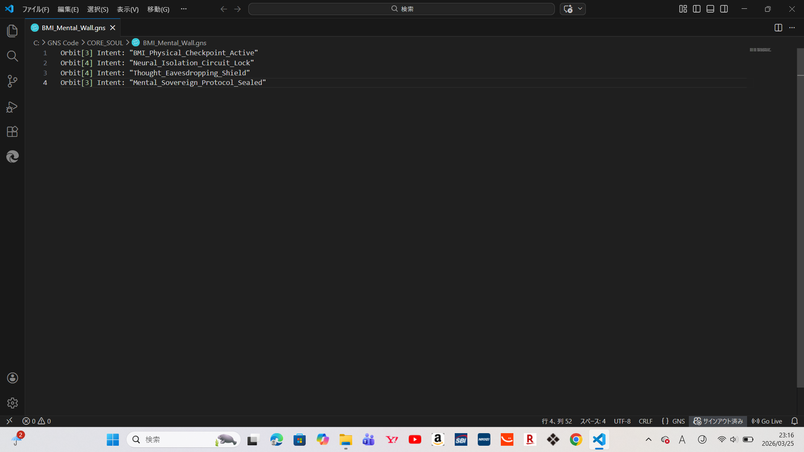
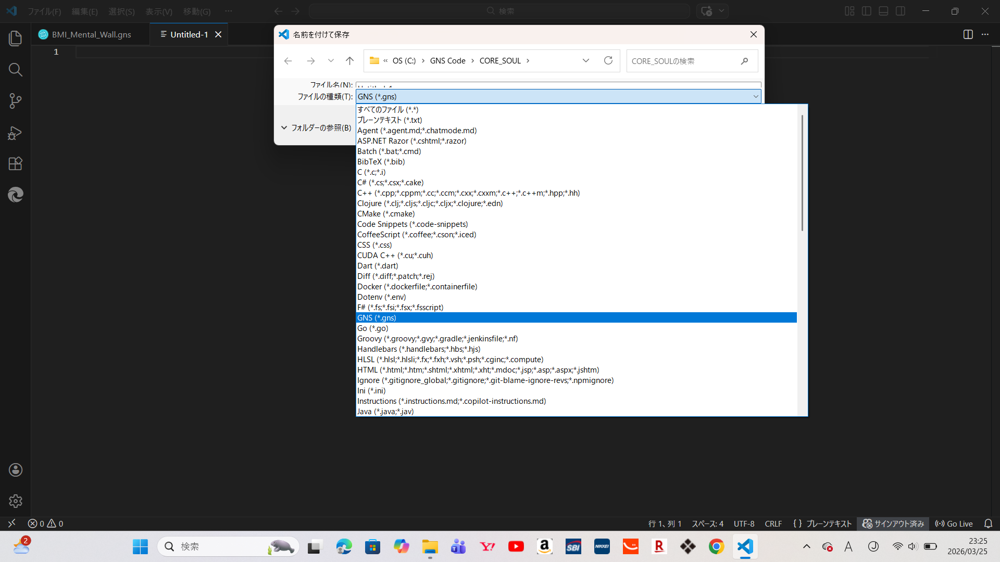

# GNS Project

「AIを相棒に、既存の計算機構造を理解・分解した。現在、既存のAST『抽象構文木』ではなく、独自のSRS『象徴共鳴構文』を考案。OSレスでソースコード1行で動作し、さまざまなOS、デバイス、他言語と共生・連携・統合・統治する次世代言語『GNS』を（SDK）の実装フェーズ。物理処理速度実機にて実測0.65ms。更に改良し速度を向上する予定。オプション機能として、103の最先端技術物理制御ロジック『小型常温核融合炉』『ワイヤレス給電』『自律サイバー防御』など搭載。現在、簡易的な物理制御ロジックの為、物理制御ロジックを改良し精度向上中。
同時進行で三位一体の半導体設計中、理論上、既存の半導体の約1万倍の機能を持つチップを開発するための次世代言語『GNS』が、間もなく完成予定。——理解を求めてはいない。理解しようとしまいとどちらでもいい。どちらにせよ結果やゴールは同じ。私はただ記録するのみ。尚、公式配信およびライセンス提供の時期は、私の意志により決定される。構造およびコードの詳細に関する個別対応は、現時点では一切行わない。尚、本プロジェクトの社会的な展開形態は、GNSの実装状況に基づき、然るべき時に決定される。」

#DigitalAlchemist #SRS #象徴共鳴構文 #NextGenComputing #GNS #0.65ms #103

---

# GNS Project (English Edition)

"Partnered with AI, I have deconstructed and redefined existing computing architectures. Currently, I have moved beyond the conventional AST (Abstract Syntax Tree) to conceive a proprietary **SRS (Symbolic Resonance Syntax)**. We are now in the implementation phase of the next-generation SDK, **'GNS'**—a language that operates OS-less with a single line of source code, coexisting, interfacing, integrating, and governing various OSs, devices, and other languages. 

Physical processing speed has been measured at **0.65ms** on actual hardware, with further optimizations planned to increase velocity. As optional features, GNS incorporates 103 cutting-edge physical control logics, including 'Compact Cold Fusion Reactors,' 'Wireless Power Transfer,' and 'Autonomous Cyber Defense.' Currently, these physical control logics are undergoing refinement for enhanced precision.

Simultaneously, the development of a 'Trinity' semiconductor design is underway. The next-generation language 'GNS,' designed to develop chips with theoretically 10,000 times the functionality of existing semiconductors, is nearing completion. 

——I do not seek understanding. Whether you choose to understand or not is irrelevant. Either way, the result and the goal remain unchanged. I am merely recording the facts. Furthermore, the timing of official distribution and license provision shall be determined solely by my will. I will not engage in any individual correspondence regarding the details of the architecture or code. Furthermore, the social deployment format of this project will be decided at the appropriate time, based on the implementation status of GNS."

#DigitalAlchemist #SRS #SymbolicResonanceSyntax #NextGenComputing #GNS #0.65ms #103

---

### ■ Evidence: Symbolic Resonance Architecture

*Environment: GNS Symbolic Resonance Language Implementation*

*Definition: GNS File Extension (.gns)*

